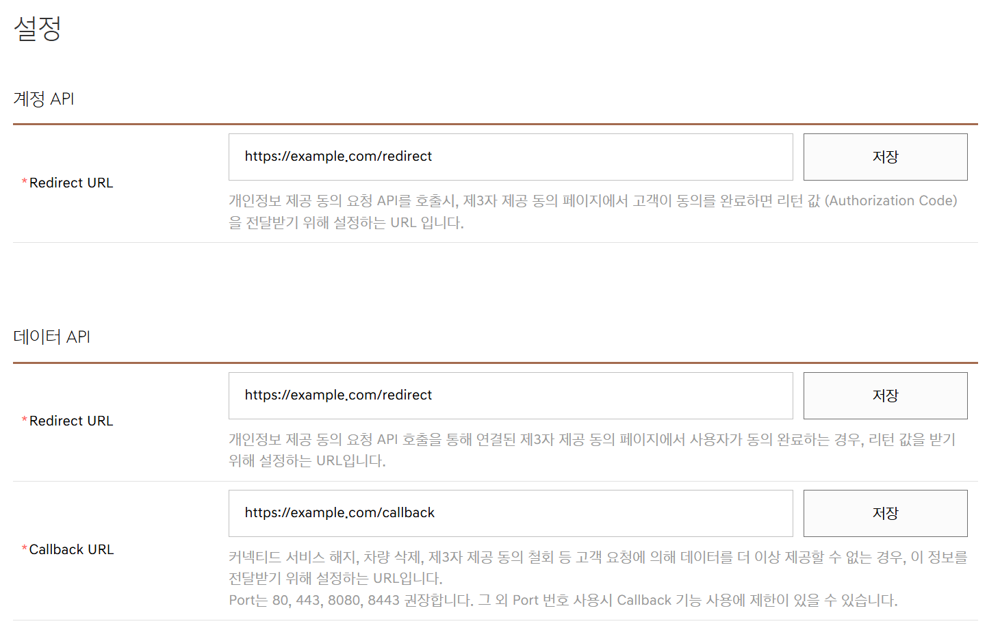

# Hyundai, Kia, and Genesis developer project setup

[한국어](developer-setup.md) | **English**

The Hyundai, Kia, and Genesis developer consoles use the same project
registration flow and Settings screen. Complete membership and project setup
separately for every brand you want to connect.

## Before you begin

- Prepare the account that holds the vehicle's Bluelink, Kia Connect, or
  Genesis Connected Services contract.
- Vehicles shared with others and vehicles received through sharing may be restricted
  in the developer console or vehicle list.
- Do not disclose the Client ID, Client Secret, or a URL containing an
  authorization code.

## 1. Join and sign in to the developer console

| Brand | Official guide | Project list |
| --- | --- | --- |
| Hyundai | [Console guide](https://developers.hyundai.com/web/v1/hyundai/guide_console) | [Hyundai project list](https://console.developers.hyundai.com/web/v1/project/project_list) |
| Kia | [Console guide](https://developers.kia.com/web/v1/kia/guide_console) | [Kia project list](https://console.developers.kia.com/web/v1/project/project_list) |
| Genesis | [Console guide](https://developers.genesis.com/web/v1/genesis/guide_console) | [Genesis project list](https://console.developers.genesis.com/web/v1/project/project_list) |

Join the developer service for the brand you use and open its project list.

## 2. Create a project

1. Select **New project registration** from the project list.
2. Enter the project name and the information requested by the console.
3. Review the terms and finish creating the project.
4. Open the new project to enter its detail page.

Create a separate project in each brand console when you use more than one
brand. Client credentials cannot be shared across brands.

## 3. Register your vehicle

1. Select **My vehicle registration** on the project detail page.
2. Choose the vehicle connected to your connected-service contract holder account.
3. Complete vehicle registration and the required consent.
4. Confirm that the vehicle is **active** in this same project. Appearing in the list
   alone does not establish that activation is complete.

If the vehicle is absent, confirm that the developer user is the holder of the
connected-services contract. If the provider authorization page shows no vehicles,
you may be unable to proceed far enough to receive an authorization code. See the
[troubleshooting guide](troubleshooting.en.md).

## 4. Save all three URLs separately

Select **Settings** on the project detail page and enter these exact values.

| Section | Field | Value |
| --- | --- | --- |
| Account API | Redirect URL | `https://example.com/redirect` |
| Data API | Redirect URL | `https://example.com/redirect` |
| Data API | Callback URL | `https://example.com/callback` |

Each field has a separate **Save** button. Saving the first field does not save
the other two. Enter all three values and click **Save** three times in total.

Confirm the following details.

- Match the capitalization and paths shown in the table.
- Do not add a trailing `/`.
- The Account API and Data API Redirect URLs have the same value.
- Only the Callback URL ends in `/callback`.
- Reopen the screen and confirm that all three values remain saved.

## 5. Obtain the Client ID and Client Secret

1. Select **Project overview** on the project detail page.
2. Copy the **Client ID** and **Client Secret**.
3. Store them in a secure location such as a password manager.

Do not include the Client Secret in GitHub issues, logs, or screenshots. If exposed,
use the provider's credential revocation or replacement options, or its private
support channel. Enter replacement credentials using **Reconfigure** in Home Assistant.

## 6. Authorize from Home Assistant

1. Open **Settings → Devices & services → Add integration** in Home Assistant.
2. Select **Hyundai Kia Genesis Developers**.
3. Select the project's brand and enter its Client ID and Client Secret.
4. Open the displayed authorization link and sign in with the connected-services
   account.
5. Select a vehicle and approve access.
6. At the registered redirect address, copy the full URL containing `code` and `state`.
7. Paste that URL into the Home Assistant field.

An `example.com` page error can be ignored only when the final registered address
contains both `code` and `state`. Errors on the provider login page must be resolved
separately. Do not share the single-use code in the URL. If a Data API consent error
occurs, see the [troubleshooting guide](troubleshooting.en.md#errors-inside-home-assistant).

After authorization, select the vehicle and confirm its name in Home Assistant. Return to the [Home Assistant guide](../README.en.md#add-an-account-and-vehicle-in-home-assistant).
