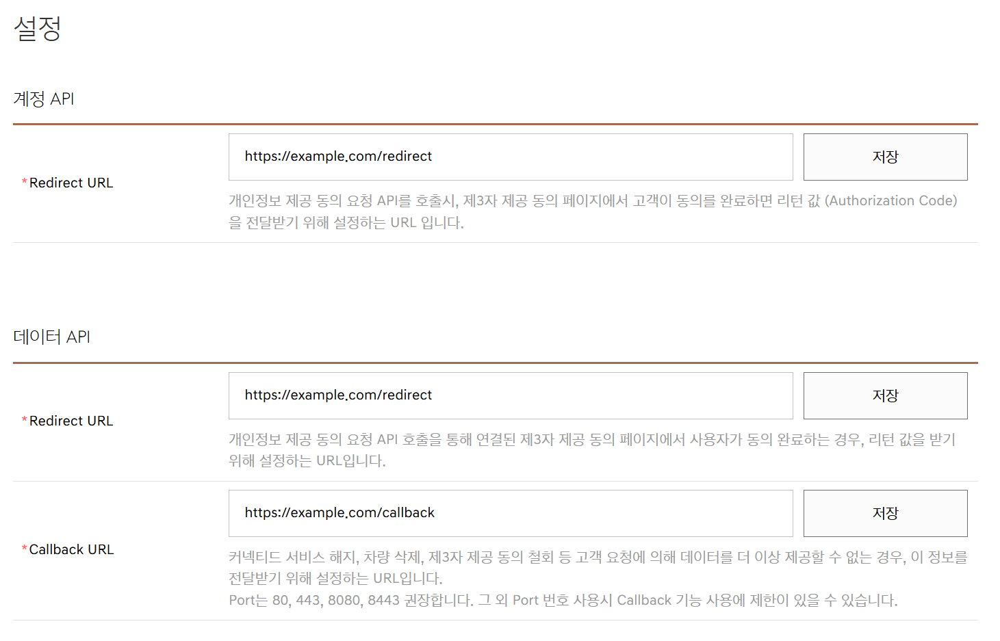

# 현대, 기아 및 제네시스 개발자 프로젝트 등록 안내

**한국어** | [English](developer-setup.en.md)

현대, 기아 및 제네시스 개발자 콘솔은 동일한 프로젝트 등록 흐름과 설정 화면을
사용합니다. 연결할 브랜드마다 회원 가입과 프로젝트 생성을 각각 진행하세요.

## 시작하기 전에

- 차량의 Bluelink, Kia Connect 또는 Genesis Connected Services 계약자 계정을
  준비합니다.
- 공유받은 차량은 개발자 콘솔이나 차량 목록에 표시되지 않을 수 있습니다.
- Client ID, Client Secret 및 인증 코드가 포함된 URL은 공개하지 않습니다.

## 1. 개발자 콘솔에 가입하고 로그인

| 브랜드 | 공식 안내 | 프로젝트 목록 |
| --- | --- | --- |
| 현대 | [콘솔 안내](https://developers.kia.com/web/v1/hyundai/guide_console) | [현대 프로젝트 목록](https://console.developers.hyundai.com/web/v1/project/project_list) |
| 기아 | [콘솔 안내](https://developers.kia.com/web/v1/kia/guide_console) | [기아 프로젝트 목록](https://console.developers.kia.com/web/v1/project/project_list) |
| 제네시스 | [콘솔 안내](https://developers.genesis.com/web/v1/genesis/guide_console) | [제네시스 프로젝트 목록](https://console.developers.genesis.com/web/v1/project/project_list) |

사용할 브랜드의 개발자 서비스에 가입하고 프로젝트 목록을 엽니다.

## 2. 신규 프로젝트 생성

1. 프로젝트 목록에서 **신규프로젝트 등록**을 누릅니다.
2. 프로젝트 이름과 콘솔에서 요구하는 정보를 입력합니다.
3. 약관을 확인하고 프로젝트 생성을 완료합니다.
4. 생성된 프로젝트를 열어 상세 화면으로 이동합니다.

브랜드가 둘 이상이면 각 브랜드 콘솔에서 별도 프로젝트를 만드세요. 다른 브랜드의
Client ID와 Client Secret을 함께 사용할 수 없습니다.

## 3. 내 차량 등록

1. 프로젝트 상세 화면에서 **내차량등록**을 누릅니다.
2. 커넥티드 서비스 계정에 연결된 본인 소유 차량을 선택합니다.
3. 등록을 완료한 뒤 프로젝트에 차량이 표시되는지 확인합니다.

차량이 보이지 않으면 로그인한 개발자 계정이 커넥티드 서비스 계약자 계정과
일치하는지 확인하세요. 차량이 없는 계정은 프로젝트와 인증 설정까지 진행할 수
있지만 Home Assistant에서 차량을 검색할 수 없습니다.

## 4. URL 세 개를 각각 저장

프로젝트 상세 화면에서 **설정**을 누릅니다. 아래 값을 정확히 입력하세요.

| 구역 | 항목 | 값 |
| --- | --- | --- |
| 계정 API | Redirect URL | `https://example.com/redirect` |
| 데이터 API | Redirect URL | `https://example.com/redirect` |
| 데이터 API | Callback URL | `https://example.com/callback` |

각 입력란 오른쪽에 별도의 **저장** 버튼이 있습니다. 첫 번째 값을 저장해도 두 번째와
세 번째 값은 저장되지 않습니다. 세 값을 입력한 뒤 **저장**을 총 세 번 누르세요.

다음 사항도 확인하세요.

- 대소문자와 경로를 표의 값과 동일하게 입력합니다.
- URL 끝에 `/`를 추가하지 않습니다.
- 계정 API와 데이터 API의 Redirect URL은 같은 값입니다.
- Callback URL만 `/callback`으로 끝납니다.
- 화면을 다시 열어 세 값이 모두 남아 있는지 확인합니다.

## 5. Client ID와 Client Secret 확인

1. 프로젝트 상세 화면의 **프로젝트 개요**를 누릅니다.
2. **Client ID**와 **Client Secret**을 복사합니다.
3. 비밀번호 관리자와 같은 안전한 위치에 보관합니다.

Client Secret을 GitHub 이슈, 로그 또는 스크린샷에 포함하지 마세요. 자격 증명이
노출되었다면 해당 프로젝트를 삭제하거나 자격 증명을 재발급하세요.

## 6. Home Assistant에서 인증

1. Home Assistant에서 **설정 → 기기 및 서비스 → 통합 구성요소 추가**를 엽니다.
2. **Hyundai Kia Genesis Developers**를 선택합니다.
3. 프로젝트와 같은 브랜드를 선택하고 Client ID와 Client Secret을 입력합니다.
4. 표시된 인증 링크를 열고 커넥티드 서비스 계정으로 로그인합니다.
5. 데이터 제공에 동의합니다.
6. 브라우저가 `example.com`으로 이동하면 주소 표시줄의 전체 URL을 복사합니다.
7. 복사한 URL을 Home Assistant 입력란에 붙여 넣습니다.

`example.com`에서 빈 화면이나 오류가 표시되는 것은 정상입니다. 페이지 내용이 아니라
주소 표시줄의 전체 URL이 필요합니다. 이 URL에는 일회용 인증 코드가 있으므로 다른
사람에게 공유하지 마세요.

설정이 끝났습니다. [Home Assistant 사용 안내](../README.md#home-assistant에-계정과-차량-추가)로
돌아가세요.
